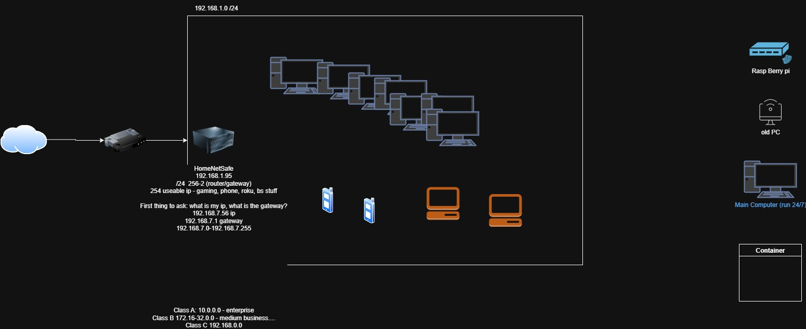

                        
                                

Team Becrux submission for CSULB Project Starbound, currently ran as a script with modules to be installed but will be containarized via Docker to run as a "one click" application on user devices 

### Getting Started
Currently configured to run on windows, but easily translated into Linux/MacOS systems. 

Windows Users only 
- Please be sure to install NPCAP to run program

MacOS/Linus Users only
- Please replace "wifi" on line 28 to "ens33"

### How to run the program on Windows

Navigate to the correct folder in VSCode

Open the terminal and make sure you are in the folder that contains the requirements.txt file.
cd /path/to/your/project

Make a venv (if you haven't made one yet) by running:
python -m venv HNS_venv

Activate the venv by running:
HNS_venv\Scripts\activate

Install all dependencies to the venv using:
pip install -r requirements.txt

Make sure you are using the right interpreter by
- clicking on View>Command Palette
- type in interpreter and click on "Python: Select Interpreter"
- click on the option that contains 'HNS_venv' in the name

### Installation
run the following in command line/powershell (skip if followed "How to run the program on Windows" steps)

- `pip install scapy`
- `pip install click_spinner`
- `pip install mac_vendor_lookup`

If on windows, instal "Npcap" from browser

### Usage
Run `ipconfig` within command line
replace x on line 75 with IPv4 address 

### Roadmap
- [x] LAN Device Discovery
- [ ] Tying devices to manufacturer and device names 
- [ ] Scan for New/Unknown Devices/Alerts on a new device/Unanaswered Packets
- [ ] Frontend UI, user should not have to replace anything within code or find there IPv4 address 
- [ ] Raspberry Pi OS localization

### Project Schematics
 
